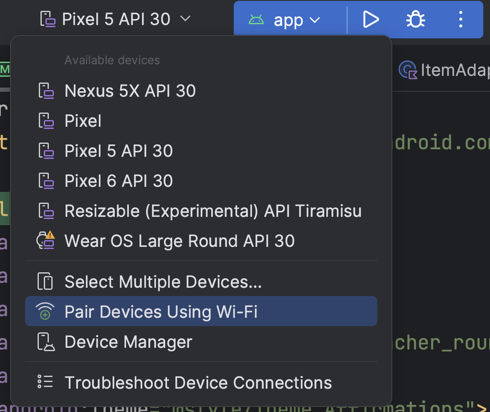
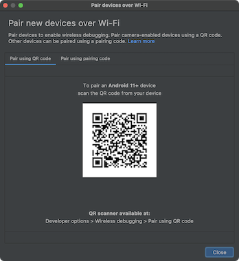
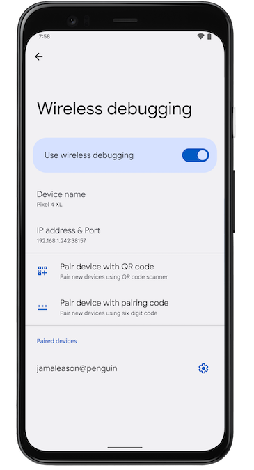
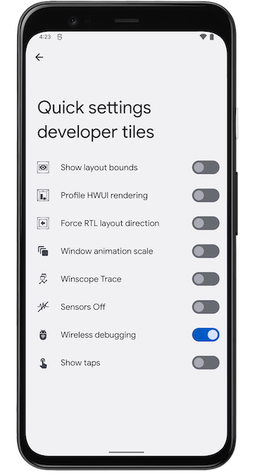

# Comment manipuler son Android Via **ADB (Android Debug Bridge)**

Le site de refférence est https://developer.android.com/studio/command-line/adb?hl=fr

```
Android Debug Bridge (adb) est un outil de ligne de commande polyvalent qui vous permet de communiquer avec un appareil. La commande adb facilite diverses actions sur l'appareil, telles que l'installation et le débogage des applications. adb donne accès à un shell Unix que vous pouvez utiliser pour exécuter différentes commandes sur un appareil. Il s'agit d'un programme client-serveur qui comprend trois composants :

Un client, qui envoie des commandes. Le client s'exécute sur votre ordinateur de développement. Vous pouvez appeler un client à partir d'un terminal de ligne de commande en exécutant une commande adb.
Un daemon (adbd), qui exécute des commandes sur un appareil. Le daemon s'exécute en tant que processus en arrière-plan sur chaque appareil.
Un serveur, qui gère la communication entre le client et le daemon. Le serveur s'exécute en tant que processus en arrière-plan sur votre ordinateur de développement.
```

 ### Fonctionnement d'adb

 Lorsque vous démarrez un client adb, il vérifie d'abord si un processus de serveur adb est déjà en cours d'exécution. Dans le cas contraire, il lance le processus de serveur. Lorsque le serveur démarre, il se lie au port TCP local 5037 et écoute les commandes envoyées par les clients adb.

 Le serveur configure ensuite les connexions à tous les appareils en cours d'exécution. Il localise les émulateurs en analysant les ports impairs compris dans la plage 5555-5585, qui est utilisée par les 16 premiers émulateurs. Lorsque le serveur trouve un daemon adb (adbd), il établit une connexion à ce port.

Chaque émulateur utilise une paire de ports séquentiels : un port pair pour les connexions à la console et un port impair pour les connexions adb. Exemple :

Émulateur 1, console : 5554
Émulateur 1, adb : 5555
Émulateur 2, console : 5556
Émulateur 2, adb : 5557
, etc.

Comme indiqué, l'émulateur connecté à adb sur le port 5555 est le même que l'émulateur dont la console écoute sur le port 5554.

Une fois que le serveur a établi les connexions à tous les appareils, vous pouvez utiliser les commandes adb pour accéder à ces appareils. Comme le serveur gère les connexions aux appareils ainsi que les commandes de plusieurs clients adb, vous pouvez contrôler n'importe quel appareil depuis n'importe quel client (ou à partir d'un script).

### Etapes pour configurer ADB

1. Téléchargez plateform-tools
2. Configurez-le
    - Supprimez son dossier (platform-tools), puis remplacez par le nouveau (en cas de disfonctionnement)
    - Ajoutez le dans les variables d'environnements (ex: C:\Users\Pinto Katende\AppData\Local\Android\Sdk\platform-tools)

3. Testez avec la commande ```adb```

### Manipulation
- Branchez le téléphone avec le débogage activé
- ```adb devices``` : Affiche appareils connectés

### ADB Sans Fil

```
Remarque : Android 11 (niveau d'API 30) ou version ultérieure est compatible avec le déploiement et le débogage sans fil de votre application depuis votre poste de travail à l'aide d'Android Debug Bridge (adb).
```

#### Etapes

+ Assurez-vous que votre station de travail et votre appareil sont connectés au même réseau sans fil.

+ Assurez-vous que votre appareil est équipé d'Android 11 (niveau d'API 30) ou version ultérieure pour téléphone, ou d'Android 13 (niveau d'API 33) ou version ultérieure pour téléviseur et Wear OS.

+ Assurez-vous que vous avez installé la dernière version d'Android Studio.

+ Sur votre station de travail, installez la dernière version de SDK Platform Tools.

#### Utilisations locales
Pour utiliser le débogage sans fil, vous devez associer votre appareil à votre station de travail à l'aide d'un code QR ou d'un code d'association. Votre station de travail et votre appareil doivent être connectés au même réseau sans fil. Pour vous connecter à votre appareil, procédez comme suit :

1. Activez les options pour les développeurs sur votre appareil.
2. Ouvrez Android Studio, puis sélectionnez Pair Devices Using Wi-Fi (Associer des appareils à l'aide du Wi-Fi) dans le menu des configurations d'exécution.



La fenêtre Pair devices over Wi-Fi (Associer des appareils en Wi-Fi) s'affiche, comme illustré dans la figure 2.



3. Sur votre appareil, appuyez sur Débogage sans fil et associez votre appareil :



a. Pour associer votre appareil à un code QR, sélectionnez Associer un appareil avec un code QR, puis scannez le code QR obtenu dans la fenêtre pop-up Associer des appareils en Wi-Fi, comme illustré dans la figure 2.

b. Pour associer votre appareil avec un code d'association, sélectionnez Associer l'appareil avec un code d'association dans la fenêtre pop-up Associer des appareils en Wi-Fi. Sur votre appareil, sélectionnez Associer à l'aide du code d'association, puis notez le code à six chiffres fourni. Une fois que votre appareil apparaît dans la fenêtre Associer des appareils en Wi-Fi, vous pouvez sélectionner Associer et saisir le code à six chiffres affiché sur votre appareil.

4. Une fois votre appareil associé, vous pouvez essayer de déployer votre application sur votre appareil.

Pour associer un autre appareil ou pour supprimer l'appareil actuel de votre station de travail, accédez à Débogage sans fil sur votre appareil. Appuyez ensuite sur le nom de votre station de travail sous Appareils associés, puis sélectionnez Supprimer.

5. Si vous souhaitez activer et désactiver rapidement le débogage sans fil, vous pouvez utiliser les Blocs Réglages rapides pour les développeurs pour le Débogage sans fil, sous Options pour les développeurs > Blocs Réglages rapides pour les développeurs.



### Connexion Wi-Fi via la ligne de commande

Pour vous connecter à votre appareil via la ligne de commande sans Android Studio, procédez comme suit :

1. Activez les Options pour les développeurs sur votre appareil, comme décrit précédemment.

1. Activez le débogage sans fil sur votre appareil, comme décrit précédemment.

1. Sur votre station de travail, ouvrez une fenêtre de terminal et accédez à android_sdk/platform-tools.

1. Recherchez votre adresse IP, votre numéro de port et votre code d'association en sélectionnant Associer l'appareil avec un code d'association. Notez l'adresse IP, le numéro de port et le code d'association affichés sur l'appareil.

1. Sur le terminal de votre station de travail, exécutez adb pair ipaddr:port. Utilisez l'adresse IP et le numéro de port ci-dessus.

1. Lorsque vous y êtes invité, saisissez le code d'association, comme indiqué ci-dessous.


### Se connecter à un appareil via le Wi-Fi (Android 10 et versions antérieures)

En principe, adb communique avec l'appareil via USB, mais vous pouvez aussi utiliser adb via le Wi-Fi. Pour connecter un appareil équipé d'Android 10 (niveau d'API 29) ou version antérieure, procédez comme suit via USB :

- Connectez votre appareil Android et l'ordinateur hôte adb à un réseau Wi-Fi commun.

- Connectez l'appareil à l'ordinateur hôte à l'aide d'un câble USB.

- Définissez l'appareil cible pour qu'il écoute une connexion TCP/IP sur le port 5555 

```shell
adb tcpip 5555
```
- Débranchez le câble USB de l'appareil cible.
- Recherchez l'adresse IP de l'appareil Android
- Connectez-vous à l'appareil par son adresse IP :
```shell
adb connect device_ip_address:5555
```
- Vérifiez que votre ordinateur hôte est connecté à l'appareil cible 

```shell
$ adb devices
List of devices attached
device_ip_address:5555 device
```

- Votre appareil est désormais connecté à adb.

- Si la connexion adb à votre appareil est perdue :

    - Assurez-vous que votre hôte est toujours connecté au même réseau Wi-Fi que votre appareil Android.
    - Reconnectez-vous en exécutant à nouveau l'étape ```adb connect```.

    - Si cela ne fonctionne pas, réinitialisez votre hôte adb :
        ```adb kill-server```

### COMMANDES
```  adb devices -l ``` : affiche ces informations d'état pour chaque appareil :
- Numéro de série
- État : 
    - offline
    - device 
    - no device
- Description

```adb devices``` : List of devices attached

- ```adb -s <emulator_id> shell getprop ro.product.model``` : Affiche la marque du téléphone.

Ex: 
```shell
$ adb -s 07766251CH100375 shell getprop ro.product.model
TECNO KG7h
```

- ```adb install APKPure_v3.19.5401_apkpure.com.apk ``` : install l'application apkure

#### Copier des fichiers vers et depuis un appareil

1. Du téléphone vers le pc : 
```adb pull telephone PC```

Ex: 
```shell
adb pull cd "/sdcard/Music/TUMAINI NJOLE - NYAMAZA KIMYA (Official Audio) (128k).mp3" "C:/Users/Pinto Katende/Desktop/exemple"
```

2. Pc -> téléphone : Fichier ou dossier
```adb pull PC telephone```

Pour copier un fichier ou un répertoire et ses sous-répertoires **depuis** l'appareil, procédez comme suit :

```adb pull telephone PC```

Pour copier un fichier ou un répertoire et ses sous-répertoires **vers** l'appareil, procédez comme suit :

```adb push PC telephone```

#### Exécuter des commandes shell
Ex: 
```shell

$ adb shell ls : Identique à la commande ls
$ adb shell ls sdcard : ls pour les dossiers du téléphone
$ adb shell ls /sdcard/DCIM/

$ adb shell am start -a android.intent.action.VIEW : émettre une commande de gestionnaire d'activités directement depuis adb sans accéder à un shell distant
```

#### Appeler le gestionnaire de packages (pm)

Dans un shell adb, vous pouvez émettre des commandes avec le gestionnaire de packages (pm) pour effectuer des actions et des requêtes sur les packages d'applications installés sur l'appareil.

Dans un shell, la syntaxe pm est la suivante :
```pm command```

Vous pouvez également émettre une commande de gestionnaire de packages directement depuis adb sans accéder à un shell distant. Exemple :

```adb shell pm uninstall com.example.MyApp```

***Pour allumer whatsapp, voici la commande :***

```
adb shell am start -n com.whatsapp/.Main
```

Piste à explorer 

Quelques flag : 
- -f : consulter le fichier associé.
- -d : filtrer pour n'afficher que les packages désactivés.
- -e : filtrer pour n'afficher que les packages activés.
- -s : filtrer pour n'afficher que les packages système.
- -3 : filtrer pour n'afficher que les packages tiers.
- -i : consulter le programme d'installation des packages.
- -u : inclure les packages désinstallés.

#### Faire une capture d'écran
```screencap filename```
Ex : 
```shell
adb shell screencap /sdcard/screen.png
``` 

##### Capture d'écran et récupérer le fichier sur PC

```shell
$ adb shell screencap /sdcard/screen.png
$ adb pull /sdcard/screen.png .
```

#### Enregistrer une vidéo
```screenrecord [options] filename```

Pour utiliser screenrecord à partir de la ligne de commande, saisissez la commande suivante :

```adb shell screenrecord --size 1280x720 --bit-rate 2000000 /sdcard/demo.mp4```

``` Ctrl+C``` Arrête l'enregistrement$

#### MANIPULATION SANS FIL 
---

1. Connectez-vous au même réseau
1. Utilisez l'USB
1. Activez le débogage
1. Vérifiez si le téléphone est connecté avec ```adb devices```
1. Ouvrez un port (ex : 5000): 
```shell
$adb tcpip 5000
restarting in TCP mode port: 5000
```
1. Retrouvez l'ip du téléphone
```shell
Ex : Via termux : $ifconfig
```
1. Puis connectez l'appareil
```shell
$adb connect ip:port
$adb connect 192.168.45.202:5000
failed to authenticate to 192.168.45.202:5000
```
Pas de panique en cas de failed, juste autorisez sur le téléphone.

```shell
$adb connect 192.168.45.202:5000
already connected to 192.168.45.202:5000
```

Maintenant exécutez les commandes à distance.